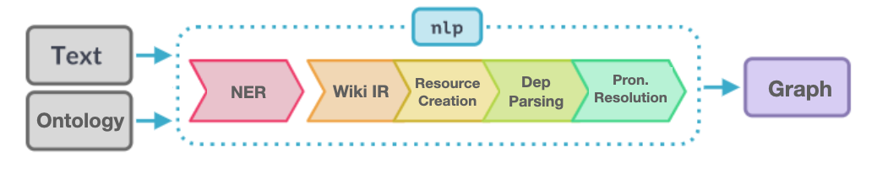

# textToRDFGraph



See the entire project description and pipeline documentation [here](https://sepidehalassi.github.io/textToRDFGraph/)!

## An automatic pipeline to construct RDF-star-based graph from unstructured texts
**textToRDFGraph** project aims to develop an automatic information retrieval pipeline based on Natural Language 
Processing and Semantic Web technologies to construct a knowledge graph from textual data that can be queried 
for the embedded references in texts regardless of the text language. 

Using RDF-star technology, the pipeline adds the metadata information about the source of the extracted information to 
the edges of the output graph allowing for faithful citation of the information and efficient query of the graph using SPARQL-star.

See the pipeline description [here](https://sepidehalassi.github.io/textToRDFGraph/pipeline)!

## Use the pipeline:

The pipeline extracts the named entities and the relations between them from texts to augment a knowledge graph. The pipeline focuses on extracting and linking three types of entries from unstructured texts in different languages: locations, persons, and their relations. Based on the language of the input text, the pipeline will be initialized with a pre-trained statistical language model. Based on the input ontology, the pipeline will extract information from the input texts in different languages and will construct the output graph, that is an RDF-star-based graph with the source of the extracted information added to the edges of the graph.

Inputs:
- path to a .txt file containing text or path to a folder containing multiple text files. At these first stage of the development, the pipeline accepts only English, German, and Farsi texts.
- **Optional:** path to the custom ontology file and corresponding SHACL shapes file that describes information to be extracted from text, retrieved from wikidata, and included in the graph . From the ontology and SHACL shapes, the pipeline extracts types of entities that should be extracted, and their relations.
- **Optional:** project name that will be used for output files and directories

Read more about the input of the pipeline [here](https://sepidehalassi.github.io/textToRDFGraph/pipeline/inputs/)!  

To start the pipeline with default parameters:

```
text_path = os.path.join(working_dir, 'inputs', 'test_data', 'dh2023', 'en_swiss.txt')
pipeline(data_path=text_path)
```
This will make a folder called `test` containing all outputs of the pipeline including the graph serialized as Turtle. 

To start the pipeline with custom ontology, SHACL shapes, project name, and multiple text files in `inputs/test_data/dh2023` folder:

```
ontology_path = os.path.join(working_dir, 'inputs', 'example_onto.ttl')
shacl_path = os.path.join(working_dir, 'inputs', 'example_shacl.ttl')
project_name = 'dh2023'
data_folder = os.path.join(working_dir, 'inputs', 'test_data', 'dh2023')

pipeline(data_path=data_folder,
         ontology_path=ontology_path,
         shacl_path=shacl_path,
         project_name=project_name)
```
This will make a folder called `dh2023` containing all outputs of the pipeline including the graph serialized as Turtle. 

Upon start of the program, user is asked to choose between spaCy and Flair libraries to be used for the NER (Named Entity Recognition) pipe. If spaCy is chosen, large English or German language models is used for processing the input text. To process texts in Farsi, Flair is used.
The pipeline uses spaCy's POS-tagging and dependency parsing results, to parse the relations between entities.

